        

        <h3><code>animesh@github ~ $ ./contributions.sh</code></h3>
        

          

        <h3><code>animesh@github ~ $ whoami</code></h3>
        <table>
          <tr>
            <td valign="top"></td>
            <td valign="top"></td>
          </tr>
        </table>

        
